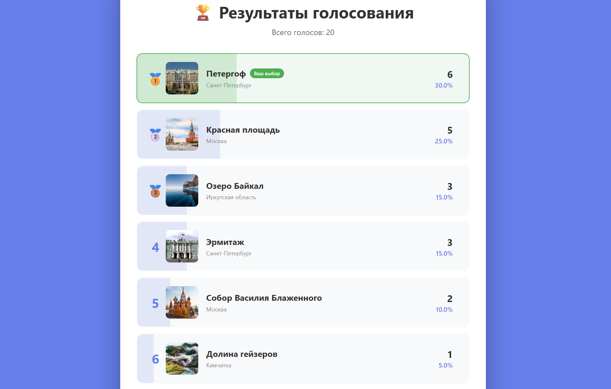

# Голосование за лучшую достопримечательность России

Веб-приложение для голосования за популярные достопримечательности России.

## 📸 Скриншоты


*Интерфейс голосования*


*Диаграмма результатов*

## 🚀 Запуск

```bash
# Установка
npm install

# Запуск
npm start
```

Откройте [http://localhost:3000](http://localhost:3000)

## 🛠 Технологии

- React
- JavaScript
- CSS

## 📝 Описание

Приложение позволяет голосовать за достопримечательности России и просматривать результаты в виде диаграммы. 
